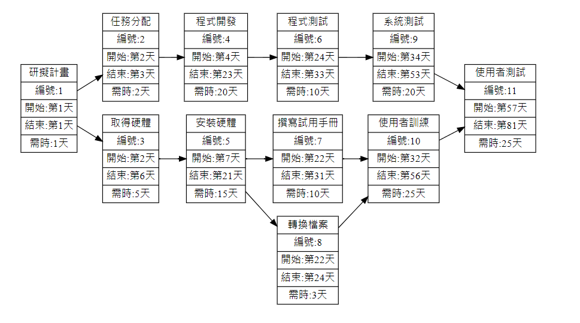

# group7

| 職位 | 學號 | 姓名 | 工作內容 |
| :-----: |:------: | :-----: | :-----: |
| 組長 | Ｃ109118209 | 蔣皓丞 | 計畫發想 、前端設計、系統測試 |
| 組員 | Ｃ109118255 | 李韋辰 | 計畫發想、後端開發、系統測試 |

## 專題題目 : 智取櫃結合WebAR互動遊戲

 

| 任務 | 說明 | 需時(天) | 前置任務 |
| :-----: |:------: | :-----: | :-----: |
| 1|研擬計畫 |1 | - |
| 2 | 任務分配 |2 |1 |
| 3|取得硬體| 5 | 1 |
| 4|程式開發 | 20 | 2 |
| 5|安裝硬體 | 15 | 3|
| 6|程式測試|10 |4 |
| 7| 撰寫使用者手冊| 10| 5 |
|8| 轉換檔案|3 | 5 |
|9| 系統測試|20 |6  |
|10| 使用者訓練|25 | 7、8 |
|11| 使用者測試|25 | 9、10 |

## 甘特圖
[![](https://mermaid.ink/img/pako:eNqdV1tv40QU_iuWV7sqUhrNjO957O2pgodWPKC8TOxxYsWxg-PsNltV4mVXWypUiS2FFSCxAqEurbgIEKDuwp_ZXPovmLHjZGZyhclLnPN937nMzDnOserGHlErah1HaVqNFLrSIA2JMrz4Ynj6V_-ry_xHtjyckr04aeFUURBA2iYEmwjl9g5x0yCOlOE3F4PnN6OrZ8PPrnML7H_3SpmuCoYlxkaMDY2SAr0cJ-q8vb3tn73oP3t69-ST3IImOhWMSthPSaJgqChUzRO5_fPL_t-fD1_e3F1f5BaD42oFFzGuIXGHV2f91-d3l2fDF6_HfgFH1gUyArLnH09H337Ne4a8a6Nga4wN5_se_HkzevX9mM37Ngu2nrFl34NPf-7_dP32zT_Di6vRR08Gp2f9px_PkbEKGWOuzOjN6eD8y8EPF4OXz3KLxpFtgazJCfx6O_z9Fz4BoXhOQTbnFm8S-ujq-fCP38YCfP0gKBSsB9jORIxFIkIUgggsRJwHVHGiwp_CYqkltUXogQ88ekWOma2qpg3SIlW1Qr96xMfdMK2qJc70Pk4CXAtJh2GOx6pqDbvNehJ3Iy-nPmoEKRkTmb2dBC2c9LbjME5yxL3d7d3tvT0OQ3OMI09C-XR5vBJNLQ1EUKMTbtiAbTa4X1Ics4ws3QCODTTn_juzQWzFiUcSiY90KmAyvr2QPwlwroI5EdDKBnJ0CC1TtwSBIva5fHt1AOMEDslRytcIalADYF6gMhLQheCciCRgUq9tOGUDjBdtaYuf-ADDICK8Py1bgj8xINFKT2K01awvPyBTwMzZqGV1hWOzo1lgZ2vGjMZmTJfgHSdJ_KhBsLc0Az-O0j3cCsJejqhWaVYJqXXdBkmVVoc9l5SHJPFwhEsKuy2hRD8IHo9vGDTbR3z5cI2EW9JVukds9uFgEZ1pS8qUmbNUFxXCDbsduvNLKlkgeJmZgo37w34QNZdvOpu4i3edeHWyv17m2E1jIajs6hpO2UQmNG2EdI3OPKdsWaahmRpENrtPVtkB0DGBZeuacJ9yucWVzOzS1aiFNEoZsy-e-3pCevy5DeoRDhcXILcfLr0a-dGIj2i0S5voBDe3yf3vSmWyKyoRxnF7BSSKUzIT2ezBymBiovSAGtiTMKu3JniI2dyc9Wma5nyk5FZnH6EHfdglkUve7bZqgqI88cYTW9SjfRVvQIDYrEJsMNMXRFDWHeFQhunBPO4KB2haKF0YBinuNGfzNzTdr7kyTEzexg7wPAnDar4f1BvpktAK3BqQHZw0l2xhAXuvm3YCj6yB3A4Dt8leUMS5p0FTkzecHK5XGg4sFqjmu5bvc8h6EvDTI2R1kpqBF0dzpJYi5QglnJsE6WwWvm_TJcPE00iEzY093JMamYjImsCSLSB0gCZSiQwD0SWD5F43g3JD3Okw1KJXHD8Iw8Nem4BFjbAAwEUjrgCgaX_UgL76LbLgaVMeRFPewpe_gqdzPMtc358x5W3-B3cm94a5vjOLC9K2F3pjtJNqdEL_SOBuGh_0IletpEmXlNRum_2f3glwPcEtteLjsDP5ddcL6NAskG0cfRDHLe5RrRyrR2oFGmXL0IFjGg4wLR0Bp6T21AoCZlmzkK4jCCzddizrpKQ-zhRA2bEtDTkw-9iGg07-BTqu23c)](https://mermaid-js.github.io/mermaid-live-editor/edit#pako:eNqdV1tv40QU_iuWV7sqUhrNjO957O2pgodWPKC8TOxxYsWxg-PsNltV4mVXWypUiS2FFSCxAqEurbgIEKDuwp_ZXPovmLHjZGZyhclLnPN937nMzDnOserGHlErah1HaVqNFLrSIA2JMrz4Ynj6V_-ry_xHtjyckr04aeFUURBA2iYEmwjl9g5x0yCOlOE3F4PnN6OrZ8PPrnML7H_3SpmuCoYlxkaMDY2SAr0cJ-q8vb3tn73oP3t69-ST3IImOhWMSthPSaJgqChUzRO5_fPL_t-fD1_e3F1f5BaD42oFFzGuIXGHV2f91-d3l2fDF6_HfgFH1gUyArLnH09H337Ne4a8a6Nga4wN5_se_HkzevX9mM37Ngu2nrFl34NPf-7_dP32zT_Di6vRR08Gp2f9px_PkbEKGWOuzOjN6eD8y8EPF4OXz3KLxpFtgazJCfx6O_z9Fz4BoXhOQTbnFm8S-ujq-fCP38YCfP0gKBSsB9jORIxFIkIUgggsRJwHVHGiwp_CYqkltUXogQ88ekWOma2qpg3SIlW1Qr96xMfdMK2qJc70Pk4CXAtJh2GOx6pqDbvNehJ3Iy-nPmoEKRkTmb2dBC2c9LbjME5yxL3d7d3tvT0OQ3OMI09C-XR5vBJNLQ1EUKMTbtiAbTa4X1Ics4ws3QCODTTn_juzQWzFiUcSiY90KmAyvr2QPwlwroI5EdDKBnJ0CC1TtwSBIva5fHt1AOMEDslRytcIalADYF6gMhLQheCciCRgUq9tOGUDjBdtaYuf-ADDICK8Py1bgj8xINFKT2K01awvPyBTwMzZqGV1hWOzo1lgZ2vGjMZmTJfgHSdJ_KhBsLc0Az-O0j3cCsJejqhWaVYJqXXdBkmVVoc9l5SHJPFwhEsKuy2hRD8IHo9vGDTbR3z5cI2EW9JVukds9uFgEZ1pS8qUmbNUFxXCDbsduvNLKlkgeJmZgo37w34QNZdvOpu4i3edeHWyv17m2E1jIajs6hpO2UQmNG2EdI3OPKdsWaahmRpENrtPVtkB0DGBZeuacJ9yucWVzOzS1aiFNEoZsy-e-3pCevy5DeoRDhcXILcfLr0a-dGIj2i0S5voBDe3yf3vSmWyKyoRxnF7BSSKUzIT2ezBymBiovSAGtiTMKu3JniI2dyc9Wma5nyk5FZnH6EHfdglkUve7bZqgqI88cYTW9SjfRVvQIDYrEJsMNMXRFDWHeFQhunBPO4KB2haKF0YBinuNGfzNzTdr7kyTEzexg7wPAnDar4f1BvpktAK3BqQHZw0l2xhAXuvm3YCj6yB3A4Dt8leUMS5p0FTkzecHK5XGg4sFqjmu5bvc8h6EvDTI2R1kpqBF0dzpJYi5QglnJsE6WwWvm_TJcPE00iEzY093JMamYjImsCSLSB0gCZSiQwD0SWD5F43g3JD3Okw1KJXHD8Iw8Nem4BFjbAAwEUjrgCgaX_UgL76LbLgaVMeRFPewpe_gqdzPMtc358x5W3-B3cm94a5vjOLC9K2F3pjtJNqdEL_SOBuGh_0IletpEmXlNRum_2f3glwPcEtteLjsDP5ddcL6NAskG0cfRDHLe5RrRyrR2oFGmXL0IFjGg4wLR0Bp6T21AoCZlmzkK4jCCzddizrpKQ-zhRA2bEtDTkw-9iGg07-BTqu23c)

## PERT

